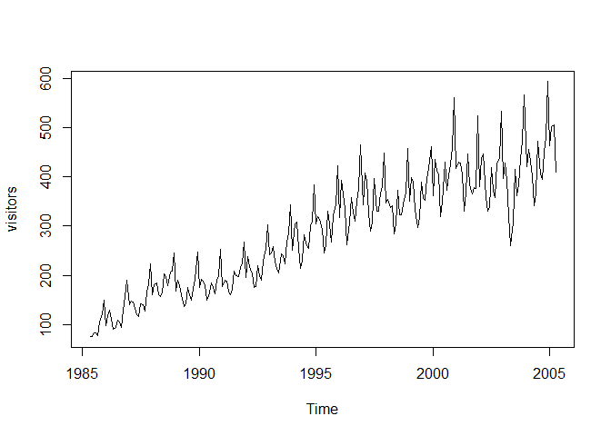
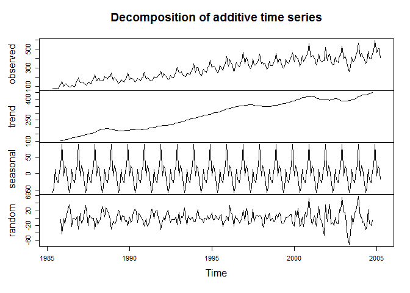
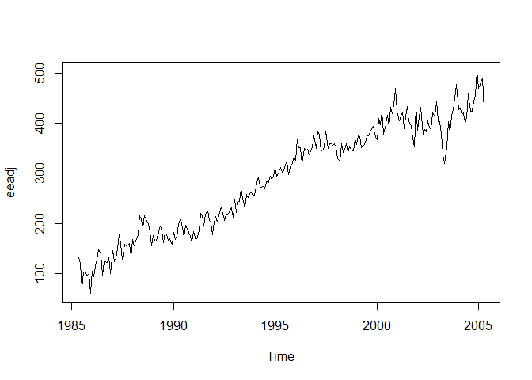

# 6306_LiveSessionAssignment9
Manjula Kottegoda  
July 20, 2016  


## Assignment

For the assigned dataset (visitors)

•	Plot the time series. Can you identify seasonal fluctuations and/or a trend? 

•	Use a classical decomposition to calculate the trend-cycle and seasonal indices. 

•	Do the results support the graphical interpretation from part (a)? 

•	Compute and plot the seasonally adjusted data. 

•	Change one observation to be an outlier (e.g., add 500 to one observation), and recompute the seasonally adjusted data. What is the effect of the outlier? 

•	Does it make any difference if the outlier is near the end rather than in the middle of the time series? 

•	Use STL to decompose the series. 
  


First we load the data

```r
#Load dataset and look at the data
data(visitors)
head(visitors)
```

```
## [1]  75.7  75.4  83.1  82.9  77.3 105.7
```

```r
summary(visitors)
```

```
##    Min. 1st Qu.  Median    Mean 3rd Qu.    Max. 
##    75.4   189.2   303.1   288.2   378.7   593.1
```


Then we plot the dataset and take a quick look

```r
#plot the data to see trends
plot(visitors)
```

<!-- -->

We can see (in plot above) there is a seasonal fluctuation pattern and an overall linear increase through the years.


Now we decompose dataset to calculate the trend-cycle and seasonal indices

```r
fitd <- decompose(visitors)
plot(fitd)
```

<!-- -->

The graphs above do confirm the initial observation of the linear increasing trend as well as the seasonal fluctuation.


No we compute and plot with seasonally adjusted data. 

```r
eeadj <- seasadj(fitd)
plot(eeadj)
```

<!-- -->


Now we change one observation to be an outlier (for example adding 500 to one observation), and re-compute. 


```r
visitorsOriginal<-visitors
visitors[50] <- visitors[50]+500 
visitors_MidOutlier <- visitors
#plot(seasadj(decompose(visitors)))
plot(visitors, main="Original data with outlier")
```

<!-- -->

```r
fitd <- decompose(visitors)
plot(fitd)
```

<!-- -->

```r
eeadj <- seasadj(fitd)
plot(eeadj, main="Seasonally adjusted data with outlier")
```

<!-- -->


The outlier is clearly visible in the plots, including the seasonally adjusted (last plot above). The overall trend plot seems to be fairly resistant to it where it only registers as a 'blip'.


Now we set an outlier at the beginning to see effect


```r
visitors<-visitorsOriginal
visitors[1] <- visitors[1]+500 
#plot(seasadj(decompose(visitors)))
plot(visitors, main="Original data with outlier")
```

<!-- -->

```r
fitd <- decompose(visitors)
plot(fitd)
```

<!-- -->

```r
eeadj <- seasadj(fitd)
plot(eeadj, main="Seasonally adjusted data with outlier")
```

<!-- -->


and now we set an outlier at the end to see effect


```r
visitors<-visitorsOriginal #reset to original data
visitors[length(visitors)] <- visitors[length(visitors)] + 500
#plot(seasadj(decompose(visitors)))
plot(visitors, main="Original data with outlier")
```

<!-- -->

```r
fitd <- decompose(visitors)
plot(fitd)
```

<!-- -->

```r
eeadj <- seasadj(fitd)
plot(eeadj, main="Seasonally adjusted data with outlier")
```

<!-- -->


While all outliers have some effect on the modelling plots, it can be observed that outliers towards the edges of dataset have a less of an effect than outliers in the middle of the dataset.


We now use the more sophisticated STL method that is more robust to outliers to decompose the dataset with the mid data outlier. If you compare with the plots above the 'blip' is less when this method is used.


```r
# use SLT with Mid outlier dataset
fit_STL <- stl(visitors_MidOutlier,s.window=7)
plot(fit_STL)
```

<!-- -->
